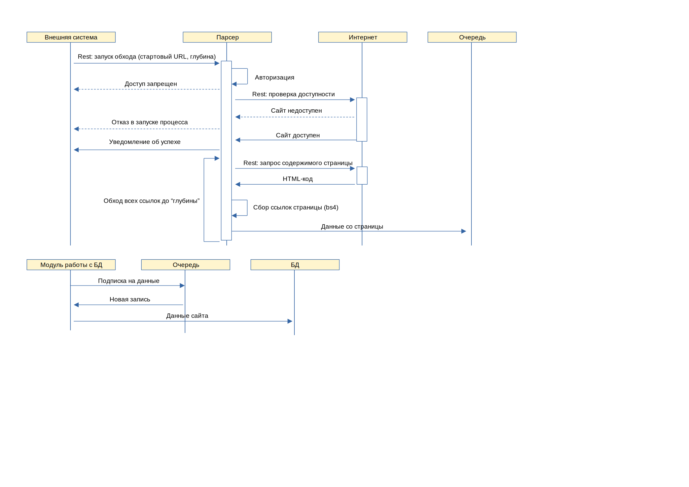

#### Парсер сайтов
Сервисы для сбора данных о сайтах и доступа к ним<br/>
[Исходная задача](/docs/case.md)

##### Задача

- Реализовать парсер произвольных сайтов и HTTP API для просмотра результатов парсинга.

##### Требования к парсеру

- должен принимать на вход адрес сайта, максимальную глубину обхода и количество одновременно загружаемых страниц
- на глубине 0, нужно сохранить только данные с переданной в параметрах страницы
- на глубине n+1, нужно сохранить данные страниц, на которые есть ссылки на странице глубины n
- под данными страницы понимается её `html`, `url` и `title`
- каждая страница должна сохраняться не больше одного раза

##### Требования к HTTP API

- нужны два метода
  - получение списка страниц с их адресами и заголовками (с возможностью поиска по обоим полям)
  - получение html конкртеной страницы
- спецификация в машиночитаемом формате (Open api, etc.)

##### Общие требования к решению

- язык реализации `python3.10`
- весь ввод-вывод асинхронный (asyncio)
- запуск в docker
- требований кроме описанных выше нет, что в частности означает, что можно использовать любые БД/фреймворк/библиотеки

##### Диаграммы
- архитектура

- последовательность (Parser)


##### Настройка (.env или непосредственно в docker-compose.yaml)
- AUTH_USERNAME - имя пользователя для запуска процесса обработки Parser'а
- AUTH_PASSWORD - пароль для запуска процесса обработки Parser'а
- DB_PORT - порт, на котором будет запущена БД во внутренней сети

<br/>
    <i>
        !!! Следующие параметры <b>изменять до первого запуска</b> или удалить базу,
        связано с тем, что при инициализации БД происходит создание самой базы
        и пользователя, повторно этот процесс не выполняется
    </i>

- DB_DATABASE - название базы данных
- DB_USERNAME - пользователь-владелец БД
- DB_PASSWORD - пароль пользователя-владельца БД

##### Запуск
``` docker-compose up -d ```

##### Остановка
``` docker-compose stop ```

##### Удаление
``` docker-compose rm ```

##### Тестирование (pytest)
- тесты на клиента не реализованы, мало функционала
- для интеграционных тестов необходимо поднять внешнее окружение или добавить сервер в текущие тесты

1. Запуск осуществляется в корневой директории
1. Перед запуском тестов необходимо установить зависимости
    ```bash
    pip install -r tests/requirements.txt
    ```
1. Настройка тестов в pytest.ini
1. Запуск тестов
    ```bash
    pytest
    ```

##### Потенциал для разработки
- добавить storage/inmemory или очереди (например, Redis/RabbitMQ)
  - реализовать интерфейс аналогично asyncio.Queue для доступа к общей очереди (storage)
  - добавить hpa на нагрузку для возможности автоматического горизонтального масштабирования
- добавить время сбора данных страницы
  - добавить "время актуальности"
  - при повторной загрузке проверять актуальность
- добавить обработку капчи
- рассмотреть возможность добавления движка, для сбора SPA и т.п.
- добавить сессии для авторизации с переданными аргументами
